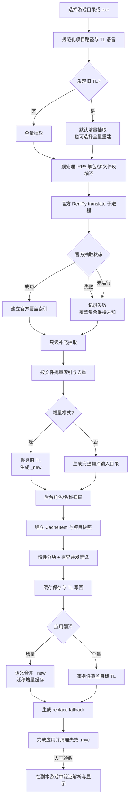

# 一键翻译完整流程与更新译文复用

本文按当前 `OneKeyTranslatePage` 的实际调用顺序说明一次“一键翻译”会做什么，并单独说明游戏更新后如何复用旧译文。文档中的“当前实现”以代码和定向测试为准；进度百分比表示阶段，不表示已经处理的文件百分比。

尚未完成的性能、观测和真实游戏验收任务见 [调查与改造方案](translation-extraction-replace-performance-plan.md)。

## 两种复用场景

一键向导检测到目标游戏已有 `game/tl/<语言>` 时，默认选择**增量抽取**。它复用的是同一个项目目录中已经存在的 TL 和缓存：旧条目保留，只把新增或发生变化的对白、`strings` 和补充候选放入 `<语言>_new`，翻译完成后再合并回主 TL。

如果游戏更新后使用了另一份游戏目录，或者需要把旧版本 `game/tl/chinese` 迁移到新版本目录，应该使用工具箱中的“更新翻译复用”。它接受“旧译文目录”和“新译文目录”两个路径，先预览，再执行安全回填。这个操作目前不是一键向导自动触发的步骤。

### Ren'Py 语言目录的边界

Ren'Py 运行时只加载当前语言目录。官方生成器把文件写到：

```text
<project>/game/<tl_directory>/<language>/<filename>.rpy
```

加载器也按 `tl_directory/<language>/...` 查找翻译文件。因此 `tl/chinese_new` 不是
`tl/chinese` 的别名，游戏不会自动读取其中的条目。`<language>_new` 是 RenpyBox
用于抽取、翻译和取消恢复的暂存目录，生命周期如下：

1. 增量抽取先把正式 `tl/<language>` 移到备份位置，再在正式路径运行官方和补充抽取；取得本次抽取快照后恢复旧 TL，并将新增内容写入暂存目录。抽取期间正式路径会短暂包含空目录或新生成的内容，不能保证同时启动游戏仍加载旧译文。
2. 抽取结束后的翻译只写增量工作目录和对应缓存；正式 TL 已恢复，未应用的增量译文不会被游戏加载。
3. 点击“应用翻译”后，按编号块、`strings` 原文和补充条目的语义规则合并到
   `tl/<language>`，校验和缓存迁移成功后才删除暂存目录。

所以“能不能直接合并”分为两个层面：最终结果必须合并到正式的
`tl/<language>` 才能生效；抽取和翻译过程中仍需要临时目录或临时文件，最后再用
原子替换落地。把 `_new` 直接改名成语言目录、或者让游戏同时扫描两个目录，都会
让未完成译文、重复编号块和半写入文件进入运行时。

复用不是模糊翻译。当前规则是：

- 编号对白按文件、语言、label、模板摘要和语句序号匹配；同一剧情块中原文改变时，不沿用旧译文。
- `strings` 按 Ren’Py 的全局原文键匹配；同一原文可以跨文件复用。
- 补充抽取条目和旧版 `replace_text` 规则只有在目标条目被标记为补漏时才参与复用。
- 目标已有非空译文时不覆盖，只记录为“已一致”或“冲突”。目标是空白或原文占位时才写入旧译文。
- 执行复用前会备份目标 TL；写回使用原子写入并重新生成需要的 replace Hook。

因此，更新后最稳妥的顺序是：先复制或备份新游戏目录，选择下面适合目录关系的
复用路线，再在新游戏目录运行增量抽取；最后只翻译仍为空或原文占位的条目。

## 一键向导的端到端流程



### 1. 选择目录、语言和运行模式

`_on_path_text_changed` 先把输入路径解析成项目根目录、`game`、`game/tl/<语言>`、RenpyBox 工作目录和应用目标目录。界面同步检查目标语言目录是否非空，据此默认勾选增量模式，并显示“跳过抽取，直接翻译”的入口；递归统计 `.rpy` 文件数使用防抖和单个后台线程，计数完成后更新显示。项目或语言改变后，旧扫描结果会被丢弃。

路径变化会刷新项目键。项目键变化时，上一项目的增量目录、自动 Hook 状态和步骤状态会清空，防止把 A 游戏的 `<语言>_new` 误用到 B 游戏。配置中的输入、输出目录会同步到当前项目，但增量输入和输出只在本次抽取上下文确认后重新绑定。

### 2. 预处理源文件

点击“抽取文本”后，步骤二先在后台检测游戏状态：

1. 有 RPA 且缺少源文件时运行解包。
2. 只有 `.rpyc` 时运行反编译。
3. 反编译器优先执行游戏自带的 `python.exe`，读取 `sys.version_info[0]`，再选择 Python 2 或 Python 3 版工具；无法探测时才使用路径回退判断。
4. 每个后台任务携带项目键和抽取代数。用户切换项目后，旧线程发出的结果会被丢弃，不会写入新项目。

初次检查、解包完成后的复检和反编译完成后的复检都使用同一个状态扫描线程；扫描期间显示“检测游戏状态”，不会占用 Qt 主事件循环。
扫描支持中断，页面退出、切换项目或语言后旧结果会被丢弃，只有仍属于当前项目和抽取代数的结果才会进入下一阶段。

解包和反编译失败时不会继续写 TL。用户可以重试、跳过抽取或修复源文件后重新开始。

### 3. 官方抽取与补充抽取

官方阶段由 `RenpyExtractor` 启动游戏自身的 Ren’Py launcher，并执行 `translate <语言>`。`Popen` 每约 0.5 秒检查一次输出、超时和取消；有输出时转发末尾内容。超时或取消会终止直接子进程，隐藏的工具文件在收尾时恢复；进程树终止、静默进程的周期心跳和结构化执行结果尚未完成。

统一抽取器分别记录 `succeeded`、`failed` 和 `not_run`。官方成功后才能将其结果作为覆盖证据；失败且启用了补充抽取时继续扫描，不能将空集合当作官方完整覆盖。整体任务失败或取消时由统一抽取器恢复旧 TL；单独调用 `official_extract()` 不包含完整 TL 备份事务。

补充阶段是只读扫描：

- 不对 `game` 源文件做去重回写；去重针对生成的 TL 输出。
- 跳过 `tl`、`miss`、备份目录、工具生成文件和已知技术字符串。
- 静态补充追加阶段按文件缓存源码位置和编号块索引，并批量写出；其他扫描阶段仍可能再次读取同一文件，尚非整个流程只读一次。
- 某原文只出现在已覆盖的普通对白中时，不再重复生成 `replace-only`；另一个同文菜单、界面或未知显示调用仍保留候选。
- 静态补充当前仍统一写为带 `replace-only` 标记的标准 `strings`。标记表示保留运行时兜底来源，不证明显示位置一定绕过原生翻译；按所有出现位置判定实际覆盖的统一路由仍待完善。

增量模式在写出新的 `<语言>_new` 前备份已有增量目录。编号对白按块身份比较；同一块中模板摘要相同的语句可保留旧译文，模板改变时用新块替换旧块。取消或失败时通过恢复日志把原 TL 和增量目录恢复到可用状态。

进度中的 70% 是“增量候选选择和写入”阶段。当前先枚举全部输入文件，在首个、末个及每 25 个文件报告位置、文件名和当前文件字节数；简单 `strings` 文件走逐行筛选，并约每秒报告扫描和选中行数。混合 TL 仍可能进入整文件 AST 解析。尚无统一的已发现文件、已处理文件、写出条目和累计读取字节统计，也未覆盖全部长操作的心跳，因此不能只用百分比判断任务是否停滞。

### 4. 抽取完成后的后台扫描

抽取成功后，界面立即显示结果。角色名、变量引用和名称候选由独立的 `CharacterScanWorker` 在后台执行，不再阻塞从 100% 进入下一步。增量目录会被记录为后续翻译输入，不能在翻译前手动合并或删除。

### 5. 翻译准备

步骤三配置术语表、角色名、禁止翻译和保留文本。步骤四根据当前运行上下文确定：

- 全量模式：输入为完整 TL 输出目录，输出为 RenpyBox 翻译工作目录。
- 增量模式：输入为 `<语言>_new` 对应的增量目录，输出为独立的增量工作目录；主 TL 只作为合并目标。

`CacheManager` 读取 TL 条目和项目快照，优先使用 SQLite，损坏或不完整时回退到 JSON。缓存条目保存 Ren’Py block、pair、模板摘要和补漏标记，后续用于增量合并和更新复用。

### 6. 翻译调度

翻译使用 `iter_item_chunks` 逐步产生分块，取得执行器空槽后才创建 `TranslatorTask`。并发上限来自配置，常见值为 16；信号量限制活跃任务，线程安全 limiter 限制任务提交速率。一个任务内部的应用重试、SDK 重试、拆分请求及 DeepLX 逐条请求尚未分别消费同一额度，因此任务提交数不等于实际 HTTP 尝试数。

当前三个预算可分别设置：`token_threshold` 保留旧字段名，控制每批非空文本行数；`max_batch_source_tokens` 控制原文 token；`max_output_tokens` 控制模型输出 token。旧配置迁移时后两项为 0，源文仍按 `max(64, 行数阈值 × 16)` 推导，输出沿用原后端默认值；全新配置源文预算为 1,024，行数仍为 10。重试轮按轮次缩小行数及显式源文预算，跨文件另行拆块，超长单条允许独立提交。

基础设置中的“均衡吞吐”一次设置为 **20 行 / 1,024 原文 token / 输出自动**。它不修改并发、超时或校验规则。要保留现有 10 行，只需单独将原文预算改为 1,024；这个预算不包含上文和动态资产。请求前另对完整生成消息做 token 估算，在平台明确提供上下文窗口时检查输入加输出预留，超过则不发送并留待后续拆批；平台未提供窗口时不猜测限制，估算也不能替代后端的精确 tokenizer。

成功结果先校验占位符、格式标签和协议，再更新缓存；取消、过期运行或项目键不一致的结果会被丢弃。运行参数使用不可变快照，但缓存保存仍在 `CacheManager` 全局锁内执行；SQLite 在事务内替换全部条目，JSON 使用事务日志恢复。锁外保存快照和 SQLite dirty rows 增量保存尚未实现。

日志中的 `[BATCH]` 会显示本轮行数/源文/输出预算、提交批数、条数、平均条/批及经过时间。当前仍记录任务级请求入口次数、累计耗时及返回的 token 用量；排队、首 token、实际在途 HTTP、内部重试等待、解析和保存耗时尚未分开统计。现有次数不能直接用于计算真实 HTTP 平均延迟。

同为 1,000 条、每条 40 token 的合成输入，10 行/旧预算产生 250 批，均衡档产生 50 批。这个结果说明减少了小批次和重复提示词，不保证服务端响应时间或实际耗时按同一倍数缩短。详细复跑命令见 [性能实验附录](translation-performance-benchmarks.md)。

### 7. 应用翻译

点击“应用翻译”后，先在后台枚举输出文件，再显示带文件数量的确认框。枚举可取消，并防止重复扫描；实际写回由 `ApplyTranslationWorker` 在后台执行：

- 全量模式使用事务性文件替换；失败时恢复本批次目标文件。
- 增量模式先把 `<语言>_new` 与主 TL 做语义合并，再迁移增量缓存。编号块按稳定身份替换，`strings` 条目按全局原文合并，已有非空译文优先保留。
- 合并和缓存迁移都成功后才删除增量目录；任何校验失败都会保留增量目录供恢复。
- 应用完成后恢复主输入、输出路径和运行清单。

### 8. replace fallback

应用 TL 后，一键流程扫描最终 TL 和补漏文件，调用 `build_old_new_replace_plan`。它合并带补漏标记的有效 `old/new` 与补漏工作译文，跳过空值、原译相同的值，并处理重复和冲突；结果写入 `replace_text_auto.rpy`。这个规则集合依赖抽取标记和覆盖筛选，不能等同于已逐个显示位置证明必须使用 Hook 的集合。

生成的 Hook 使用 schema 2 规则数据。静态原文和动态模板的最长固定字面量进入同一前缀树；动态正则在初始化时预编译，调用时由锚点筛出候选并检查固定片段顺序。匹配基于传入 RenpyBox 变换的原始文本，左到右选择非重叠区间，同起点优先最长匹配，译文不再参与本次匹配。有界缓存只缓存 RenpyBox 自身变换，并位于其他 Hook 调用之后；无锚点模板仍需参与候选检查，复杂模板的性能边界仍需测试。旧版逐条 `.replace` Hook 仍可读取并迁移。

规则数据按约 256 KiB 分组，单条超大规则允许独占一组；只有形成多组时，生产写入入口才使用 `.renpybox_replace/<内容 SHA-256>.json` 外部分片，小规则集内嵌于脚本。写入先完成新分片，再原子替换入口脚本，成功后清理失效 `.rpyc` 和过期分片。分片改善脚本体积和装载方式，调用时的候选筛选由前缀树承担。

没有有效规则时先删除 `.rpy` 和 `.rpyc`，成功后清理本工具哈希命名的遗留分片和诊断文件。入口原子写入失败时保留旧 Hook、旧编译缓存及其引用的数据。这些改动消除了逐条传入模式字符串产生的正则缓存抖动，也减少了无关规则检查；真实游戏的启动时间、复杂模板和语言切换仍需独立验收。

生成 Hook 时额外写入同目录的 `replace_text_auto.diagnostics.json`：统计静态/动态数量、脚本和数据体积、无锚点、共享锚点、多插值、重复变量及歧义模板，最多记录 100 个问题样本。报告只描述匹配风险，不修改或删掉规则，也不证明这些显示位置已由原生 TL 覆盖。诊断写入失败会记日志，已提交的 Hook 仍然有效；比对报告中的 `script_sha256` 可判断报告是否对应当前脚本。翻译输入扫描排除工具分片目录和默认诊断文件，避免把运行数据再次送去翻译。

### 9. 最终验证

以下是应用完成后的人工验收，不是一键向导自动启动游戏执行的步骤：

1. TL 文件能被 Ren’Py 解析，编号块没有重复 label 或重复语句。
2. 更新后的 Hook 不残留旧 `.rpyc`；Ren'Py 下次加载时可重新编译，并能读取入口引用的分片。空规则时脚本和编译缓存不存在；工具哈希分片清理成功，无关文件保留。
3. 官方对白、`strings` 菜单、补充静态文本和动态插值分别抽查。
4. 启动日志没有语法错误、重复注册或 Hook 初始化异常。
5. 记录写回报告、运行清单和增量合并统计；失败时从 TL 备份、增量备份或复用备份恢复。

## 游戏更新后的推荐操作

### 同一目录覆盖更新

如果游戏文件在原目录中更新，直接打开一键向导并选择“增量抽取”。它会以当前 `game/tl/<语言>` 为旧译文，抽取新增/变化内容到 `<语言>_new`，翻译后语义合并回主 TL。不要把增量目录直接复制覆盖主 TL，也不要在翻译完成前删除 `<语言>_new`。

### 新旧目录分开

如果旧版本和新版本是两个目录，有两条可用路线。两条路线都必须以新游戏的
`game/tl/<语言>` 作为最终目录；Ren'Py 不会加载一个放在目录旁边的 `_new` 目录。

**推荐路线：复制旧 TL，再用新游戏 SDK 重抽取。** 这条路线最贴近官方的目录和
编号规则，适合语言名相同、希望让 Ren'Py 自己发现新增/变化对白的更新：

1. 在新游戏副本中完成 RPA 解包和反编译，确认使用的是新游戏自带的
   `python.exe` 和 launcher。
2. 备份新目录的 `game/tl/<语言>`。将旧目录的 `game/tl/<语言>` 复制到新目录的
   同名目录。只迁移翻译源文件；`*.rpyc`、缓存、`miss_*` 工作文件和旧的
   `replace_text` Hook 不作为官方抽取输入。
3. 使用新游戏自己的 launcher 执行 `translate <语言>`（RenpyBox 的
   `RenpyExtractor` 会调用等价命令）。不要用 RenpyBox 当前 Python 代替游戏运行时，
   也不要使用 `--empty` 覆盖刚复制的译文。
4. 官方生成器会按新源码重新登记编号块和 `strings`。旧身份仍匹配的译文可以保留，
   新增或身份变化的条目会成为空的 `old/new` 或 `strings` 条目。
5. 扫描新 TL，翻译空值或原文占位。随后运行 RenpyBox 的补充抽取，处理官方没有
   覆盖的静态文本，并重新生成 replace fallback。

这条路线不能保证跨版本的所有复用：label、文件路径、语句顺序或模板摘要大幅改变
时，官方编号身份会改变；旧版 `replace-only` 也不会被 SDK 自动迁移。对这些剩余
条目，使用独立的“更新翻译复用”执行预览和安全回填，或人工确认后再翻译。

**RenpyBox 复用路线：先按身份和原文回填。** 适合需要查看冲突报告，或旧版本包含
大量补充抽取/补漏译文的情况：

1. 在新目录完成解包/反编译，使目标 TL 目录存在。
2. 打开“更新翻译复用”，旧译文选择旧目录的 `game/tl/<语言>`，新译文选择新目录的 `game/tl/<语言>`。
3. 先预览，确认可复用数、冲突数和未匹配数；再执行。执行会创建 `tl_backup_<语言>_reuse_*` 备份。
4. 回到新目录运行一键向导的增量抽取和翻译，处理更新后新增或文本已改变的条目。
5. 应用翻译后重新生成 replace fallback，并在新游戏副本启动验证。

两条路线可以组合，但顺序不能颠倒：先让新游戏 SDK 建立当前版本的官方 TL，或
先用复用工具填入已有目标条目；之后都要再做一次补充抽取和 Hook 生成。复制旧 TL
本身不会发现未写入 `_()`、菜单外静态文本，也不会知道旧补漏译文对应哪个新的
显示位置。

当前复用逻辑的安全边界是正确的：它不覆盖目标已有译文，编号块不按原文跨块猜测，写回前有备份，AST 失败时才回退到旧格式解析。它不会自动解决改写后的句子、label 大范围重命名或语义相似但原文不同的条目；这些条目必须人工确认或重新翻译。复用工具也不会替代一键向导的官方/补充抽取，因为它只迁移旧译文，不负责发现新文本。
