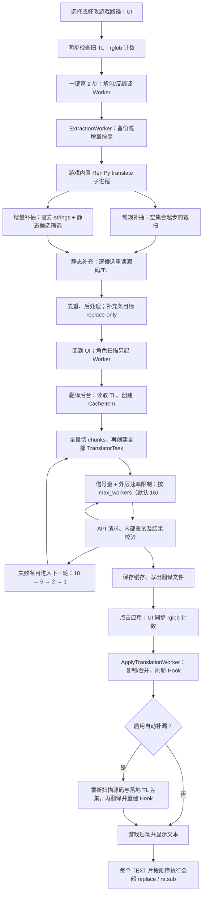

# Ren'Py 抽取、补充翻译与大文本性能调查

> 调查日期：2026-09-14；代码基线：`0fabe18`。
> 第 1–6 节保留 `0fabe18` 调查基线，第 7–8 节是方案和验收目标。**当前工作区的完成状态、这次补做的修复和剩余任务见第 9 节**，不能把基线问题或目标流程直接当成现状。
> 2026-09-14 已重新核对代码，并补做批量预算拆分、吞吐设置、UI 文件扫描后台化、Hook 分片更新失败恢复和规则诊断。实验只使用临时夹具或内存对象，没有启动用户游戏，也没有调用翻译 API。
> “本地复现”表示当前函数在明确输入下的行为已验证，不表示已经复现用户那个游戏的整段卡死。

## 1. 基线结论与优先顺序

用户的目标是完整翻译：既补官方未抽取的文本，也补“TL 已有译文但游戏实际未使用”的文本，同时避免大型游戏卡死。不能通过删除大量规则或只支持整句匹配来降低耗时。

已经确认的四个主要问题：

1. **补充抽取既可能重复收录官方对白，也把静态补充统一标记为 replace-only。** 最小夹具只有官方已抽取对白、没有菜单时，常规补抽仍新增一条 replace-only。这会同时增加 API 工作量和游戏中的替换成本。
2. **运行时 Hook 对每个 TEXT 片段遍历所有规则。** 动态规则达到 513 条后，本机测试发生正则缓存抖动：500 条未命中约 0.43 ms，513 条约 24.90 ms，3,000 条约 147.50 ms。预编译并检查固定锚点的实验显著改善，证明改造方向有效。
3. **“每批 10 行、16 并发”并不等于每分钟稳定翻译 160 条。** 代码额外把原文 token 限制为 160；实测每条 40 token 时每批只有 4 条。此外一分钟是用户观察值，当前没有对应真实 API 日志，不能判定这一分钟花在网络、推理、重试还是排队。
4. **昨天的 `dev` 修复降低了部分增量解析开销，但没有覆盖官方子进程、补充扫描线程和 70% 分离阶段。** 这些路径仍可能让抽取阶段长期没有进度；必须增加超时、取消、固定并发、单文件索引和阶段心跳。

一键抽取的另一项已复现热点：同一源码文件的 1,000 个静态候选，源文件被读取 1,000 次、TL 被读取 1,002 次。按文件缓存的实验把 5.83 秒降到 0.67 秒，生成内容完全一致。

**建议落地顺序：先加分阶段计时和修复重复扫描/Hook；并行拆分批量配置并测 API 吞吐；最后根据实测处理保存、术语和 UI 开销。** 增大翻译并发无法修复游戏运行时 Hook，分片保存规则也不能独自解决全量匹配。

## 2. 官方核心逻辑

本次联网核对官方仓库 [renpy/renpy](https://github.com/renpy/renpy)，以 tag `8.5.3.26051504` 对应提交 `39895c1e017f0b36ffea2447d97eccd69d76ee1c` 固定引用，并抽查 8.3.7。游戏实际执行的是自己携带的 Ren'Py，不能用新版本源码假定旧游戏行为。

| 环节 | 官方实现 | 对本项目的含义 |
| --- | --- | --- |
| 编号对白 | [translation/__init__.py:427](https://github.com/renpy/renpy/blob/39895c1e017f0b36ffea2447d97eccd69d76ee1c/renpy/translation/__init__.py#L427) 将语句组织成翻译单元；[generation.py:162](https://github.com/renpy/renpy/blob/39895c1e017f0b36ffea2447d97eccd69d76ee1c/renpy/translation/generation.py#L162) 按编号导出 | 普通对白、旁白、extend 的翻译身份不是全局原文字符串 |
| 菜单 | [ast.py:1880](https://github.com/renpy/renpy/blob/39895c1e017f0b36ffea2447d97eccd69d76ee1c/renpy/ast.py#L1880) 收集菜单 caption | 不要求选项写成 `_()`；同文对白不能取代菜单 strings |
| 标记字符串 | [scanstrings.py:33](https://github.com/renpy/renpy/blob/39895c1e017f0b36ffea2447d97eccd69d76ee1c/renpy/translation/scanstrings.py#L33)、[113](https://github.com/renpy/renpy/blob/39895c1e017f0b36ffea2447d97eccd69d76ee1c/renpy/translation/scanstrings.py#L113) 扫描逻辑行与静态字面量 | 支持 `_()`、`__()`、`_p()`，多行、三引号和相邻字面量；8.5.3 支持 `___()`，8.3.7 的扫描式没有该分支 |
| 文件范围 | [generation.py:422](https://github.com/renpy/renpy/blob/39895c1e017f0b36ffea2447d97eccd69d76ee1c/renpy/translation/generation.py#L422) 枚举可见的 `.rpy/.rpym/_ren.py`，跳过 `tl/` 和没有物理来源的文件 | 解包、反编译和磁盘源码是否齐全会影响命令导出，不能只看游戏总大小 |
| 命令入口 | [generation.py:492](https://github.com/renpy/renpy/blob/39895c1e017f0b36ffea2447d97eccd69d76ee1c/renpy/translation/generation.py#L492) 默认导出对白及 strings，普通字符串优先级范围 0–299 | 默认不覆盖所有内部开发者文本，也不枚举任意 Python 字符串 |
| 已有翻译 | [generation.py:179](https://github.com/renpy/renpy/blob/39895c1e017f0b36ffea2447d97eccd69d76ee1c/renpy/translation/generation.py#L179)、[258](https://github.com/renpy/renpy/blob/39895c1e017f0b36ffea2447d97eccd69d76ee1c/renpy/translation/generation.py#L258) 跳过已有编号或 old | `new == old` 也可能被视为已注册；“生成过”不等于“已翻译” |
| 实际显示 | [substitutions.py:306](https://github.com/renpy/renpy/blob/39895c1e017f0b36ffea2447d97eccd69d76ee1c/renpy/substitutions.py#L306) 先查 strings 再插值；[text.py:2363](https://github.com/renpy/renpy/blob/39895c1e017f0b36ffea2447d97eccd69d76ee1c/renpy/text/text.py#L2363) 由 Text 的 substitute 设置决定是否进入该路径 | 未写 `_()` 的静态 Text 字面量可以通过补充 strings 生效；明确禁用替换或自定义渲染的调用路径可能绕过它 |
| 运行时兜底 | [text.py:2998](https://github.com/renpy/renpy/blob/39895c1e017f0b36ffea2447d97eccd69d76ee1c/renpy/text/text.py#L2998) 在 token 化后对每个 TEXT 调用 `config.replace_text` | Hook 看到的可能已插值、已原生翻译、已被标签切成片段，并不总是源码整句；也不是每个游戏帧必调用 |

本项目 `module/Extract/RenpyExtractor.py:94` 使用游戏自带 Python 执行 `<launcher.py> <project> translate <lang>`，没有错误地设置 `--strings-only` 或 `--common-only`。包装器 `force=False` 且 TL 已存在时会直接返回；一键常规和增量路径使用 `force=True`。即便重跑，官方仍按自身的编号/old 增量规则处理。`--empty` 只改变初始 new 内容，不扩大抽取范围。

### 2.1 正式语言目录与 RenpyBox 暂存目录

官方生成器的目标路径是 `game/<tl_directory>/<language>/<filename>.rpy`，运行时加载器
也只按当前语言的 `tl_directory/<language>/...` 查找。由此可确定：

- `tl/<language>_new` 不会被 Ren'Py 当作 `<language>` 加载；它是 RenpyBox 的暂存
  输入/输出目录，不是第二个语言目录。
- 增量抽取可以在 `_new` 中完成，主 `tl/<language>` 在翻译完成前保持可启动。应用
  阶段必须把结果按编号块、`strings` 和补充条目的语义合并到正式目录，成功校验和
  缓存迁移后再删除 `_new`。
- “直接合并”可以作为用户界面上的一步操作，但底层仍应先写临时文件或临时目录，
  再原子替换正式 TL。让游戏同时扫描 `_new` 会加载未完成译文、重复块或半写入文件。

对新旧游戏目录分开的更新，另一条符合官方模型的路线是：把旧版本的
`game/tl/<language>`（不含 `.rpyc`、缓存、`miss_*` 和旧 Hook）复制到新版本同名目录，
然后用**新游戏自带**的 Python/launcher 执行 `translate <language>`。这样 Ren'Py 会
以新源码重新登记编号对白和 `strings`，保留仍能按官方身份匹配的旧译文，并生成新
增或变化条目。该操作不能迁移旧版 `replace-only`，也不能保证 label、文件路径、
语句顺序或模板摘要大幅变化后的编号仍相同；这些内容仍需 RenpyBox 的独立复用工具
和补充抽取处理。不要在此流程使用 `--empty`，否则会主动生成空翻译骨架并失去刚复制
的译文。

因此建议按场景选择：同一目录更新继续使用 `_new` 暂存和应用合并；跨目录更新优先
采用“复制旧 TL + 新游戏 SDK 重抽取”，再用 RenpyBox 复用工具处理 SDK 无法对应的
补漏译文。两条路线的最终落点都必须是 `game/tl/<language>`。

**必须分别记录四件事：发现了原文、生成了翻译条目、产生了有效译文、实际显示用了译文。** 静态扫描最多证明前三项的部分状态，不能把“TL 中找到了相同文本”当作第四项的证明。

例如 `text "Rank: [who.rank]"` 可能通过模板 strings 在插值前完成翻译；`text expression substitute False` 或作者自定义的显示路径可能绕过该过程。编号对白中有 `"Start"`，也不代表另一个界面的 `"Start"` 已被覆盖。

## 3. 基线一键翻译流程

完整的一键翻译顺序、增量目录、缓存迁移、replace fallback 以及游戏更新后的旧译文复用见 [onekey-translation-flow.md](onekey-translation-flow.md)。

以下是 `0fabe18` 的历史流程，用于解释原始热点。现工作区已改为惰性任务构造、静态补充按文件批写和 UI 后台计数，当前调用顺序以上面的完整流程文档为准。后台节点耗时长不自动等于 UI 线程死锁。



对应入口：`OneKeyTranslatePage.py:765/871/1783/2728/2834`，`OneKeyWorkers.py:678/841/929/962`，`Translator.py:1433/1485`。

已有保护需要保留：角色扫描已移到后台；主翻译完成后先应用落地 TL，自动补漏才启动；应用工作在 QThread 中。不能把这些已解决的问题再次当作当前根因。

## 3.1 当前 Git 分支与“70% 卡住”的审计

当前工作树在 `dev` 分支，HEAD 为 `0fabe18`（`fix: 修复翻译与增量抽取卡顿并兼容解包工具`），父版本为 `main` 的 `ff353ae`。该提交已经加入快速 strings 扫描、增量文件进度、后台角色扫描和输入目录日志，但它没有消除下面三条长路径，因此不能把“昨天已修复”视为已验证解决：

1. **官方抽取仍是阻塞子进程。** `RenpyExtractor.official_extract()` 使用 `subprocess.run()` 收集全部输出，没有 timeout、实时输出或取消检查。Ren'Py 自带 Python、反编译生成的脚本或某个语法错误挂起时，界面会长期停在官方阶段。修复必须使用 `Popen` + 分块读取 + deadline + cancel，并在失败时保留原 TL 备份。
2. **补充抽取仍可能创建“每个文件一个线程”。** `renpy_extract.ExtractAllFilesInDir()` 和 `remove_repeat_extracted_from_tl()` 直接为遍历到的每个 `.rpy` 创建线程，再统一 join；大型项目会出现线程、句柄、内存和磁盘随机访问峰值。应改为固定大小线程池或顺序扫描，线程数不能由文件数决定。
3. **70% 是分离新增内容，不是完成比例。** 增量流程在官方/补充抽取后于 `UnifiedExtractor.py` 发出 70% 进度，再进入 `_extract_new_entries_to_folder()`。该函数先 `list(self._iter_rpy_files(source_dir))`，然后逐文件 AST 解析、选择条目、重新写目标文件；进度最多每约 5% 更新一次。某个超大 `.rpy`、大量目标文件或磁盘写入期间，进度会长时间保持 70%，窗口可响应与否取决于调用线程和 Qt 事件队列。修复必须把“已发现文件/已处理文件/已写出条目/当前文件字节数”分开上报，不能用单个 70% 百分比掩盖长任务。

当前分支还保留一个高风险调用：补充扫描的 `ExtractFromFile(target, ..., skip_translate_block=True)` 没有显式传 `remove_duplicates=False`，而 `ExtractFromFile` 默认会调用 `remove_repeat_for_file()` 并以 `r+` 打开源码。也就是说补充扫描可能修改游戏源文件、重复读写文件并与其他扫描线程竞争。补充扫描必须是只读：显式传 `remove_duplicates=False`，禁止对 `game/` 源码做去重写回；去重只对临时 TL 输出执行。

## 3.2 两种卡死的判定与修复边界

| 现象 | 当前最可能的代码路径 | 先做的证据采集 | GPT‑5.6 应实现的修复 |
| --- | --- | --- | --- |
| 抽取阶段停在 70%，窗口仍可动 | `_extract_new_entries_to_folder()` 逐文件 AST/写盘，或补充扫描线程 join | 当前文件、文件字节、已解析/已写出计数、每文件耗时、线程池队列长度 | 固定线程池/顺序有界扫描；单文件缓存；分阶段进度；取消检查；原子临时输出 |
| 官方抽取阶段不动 | `subprocess.run()` 等待游戏 Python | 子进程 PID、最后输出时间、退出码、超时秒数 | `Popen` 实时读取、超时、取消、进程树终止；保留备份恢复 |
| 打开游戏启动或进入界面卡死 | `replace_text_auto.rpy` 每个 TEXT 片段遍历全部规则，动态规则逐条 `re.sub` | Hook 规则总数/动态数/字节数；禁用 Hook 对照；单次 Hook P50/P95 | 静态首字符/长度索引；动态固定锚点预编译；有界缓存；规则分片只用于加载，不替代索引 |
| 打开游戏报解析错误或黑屏 | 补充扫描写入非法/重复 TL，或 replace Hook 生成过大/重复脚本 | Ren'Py log、TL 解析错误行、old/new 冲突数、Hook 编译结果 | 源码只读；TL 原子写；old 唯一性校验；`.rpyc` 失效清理；失败回滚 |

“抽取读取文件有问题”和“运行时 replace 规则过大”是两个独立故障面：前者发生在生成翻译输入之前，后者发生在游戏加载/显示文本时。修复应分两阶段验收，不能用抽取进度到 100% 证明 Hook 已经安全。

## 3.5 Python 2 / Python 3 兼容性审计

当前项目是“部分兼容”，不能称为已经完整解决。

### 已经做对的部分

- `RenpyExtractor.official_extract()` 使用游戏自带的 `lib/.../python.exe` 执行游戏自己的 launcher，因此官方 `translate` 命令原则上会使用与游戏匹配的 Python 主版本和 Ren'Py 运行时。这比使用 RenpyBox 当前 Python 直接解析游戏更可靠。
- `RenpyDecompiler` 已通过执行嵌入式解释器 `python.exe -c "import sys; print(sys.version_info[0])"` 识别主版本，并选择 `unrpyc_python_v1`（Python 2）或 `unrpyc_python_v2`（Python 3）。这是当前项目中最可靠的版本检测路径。
- 补充抽取函数接收 `is_py2`，对 `_p("""...""")` 的跨行分隔和旧格式字符串做了兼容处理；官方 TL 解析使用项目自己的 escape-aware parser，不直接 `eval` 游戏源码。

### 仍然存在的风险

1. `utils.call_game_python.is_python2_from_game_dir()` 主要通过路径名中是否含 `py2`/`python2` 判断，并且找不到解释器时默认返回 `True`。如果游戏使用通用目录名 `windows-x86_64`，或解释器缺失/路径传错，Python 3 游戏可能被误判成 Python 2。
2. 补充抽取本身运行在 RenpyBox 的 Python 3 进程中，使用 Python 3 的正则、`ast`、UTF-8 文本读取；它不是在游戏内置 Python 2 中解析源码。因此 Python 2 Ren'Py 的语法、默认编码、字符串语义和 Python 3 版本不能假定完全一致。
3. 官方 Ren'Py 版本差异独立于 Python 主版本：例如官方 `scanstrings.py` 在不同 Ren'Py 版本对 `___()`、优先级和扫描范围的支持不同。不能只检测 Python 2/3 就推断官方抽取结果相同。
4. 官方 Ren'Py lexer 和 generation 在已核对版本中都以 UTF-8 读取源码并写出 TL；因此实现应以 UTF-8 为默认，并把解码失败作为明确错误/跳过原因记录，不能静默当作“没有候选”。

### GPT‑5.6 必须统一的实现

1. 建立唯一 `GameRuntimeProfile`：执行一次嵌入式 `python.exe` 探针，返回 `python_major`、Ren'Py 版本、默认编码、解释器路径和能力标签；官方抽取、反编译、补充抽取都使用同一份 profile。
2. 删除“检测失败默认 Python 2”的隐式行为，改成 `unknown` 并阻止需要版本语义的步骤，或明确要求用户选择 Python 2/3。日志必须记录检测命令、输出、路径和 fallback 原因。
3. Python 2 游戏优先走官方抽取；补充抽取应先用字节读取 + 游戏编码解码，再统一转换成 Unicode，写 TL 时固定 UTF-8。每个文件记录 `encoding_used` 和解码错误数。
4. 将 `is_py2` 从布尔参数升级为 profile/strategy，不要只在 `_p` 分支切换换行符。针对 Python 2/3 分别覆盖字符串前缀、三引号、相邻字面量、转义、菜单和 `_p` 的测试。
5. 版本差异测试至少覆盖 Ren'Py 7/Python 2、Ren'Py 7/Python 3 过渡构建、Ren'Py 8/Python 3；以游戏自带官方 TL 作为 oracle，补充抽取只能增加有来源候选，不能删除官方结果。

### 版本兼容验收矩阵

| 运行时 | 官方抽取解释器 | 反编译器 | 补充抽取要求 | 必须验证 |
| --- | --- | --- | --- | --- |
| Ren'Py 7 + Python 2 | 游戏 `python.exe` | `unrpyc_python_v1` | 游戏编码解码、旧 `_p`/字符串语义 | 官方条目数、中文/日文源码、菜单和多行 `_p` |
| Ren'Py 7 + Python 3 | 游戏 `python.exe` | 运行时探针选择 v2 | UTF-8/配置编码、旧 Ren'Py 扫描能力 | 官方结果与版本差异日志 |
| Ren'Py 8 + Python 3 | 游戏 `python.exe` | `unrpyc_python_v2` | UTF-8、现代 strings 扫描、动态候选分类 | `___()`、菜单、编号块和静态 strings |
| 无法找到游戏解释器 | 不得猜测 | 不能继续自动选择 | 只允许只读源码扫描或要求用户选择 | 明确错误，不生成可能错误的 TL/Hook |

## 3.3 给 GPT‑5.6 的实现任务单

### P0：先让抽取可取消、可回滚、不会改源码

1. **官方命令封装**：把 `subprocess.run` 替换为 `Popen`；后台读取 stdout/stderr，持续发出 `phase=official` 心跳；支持 `timeout_seconds` 和 `cancel_event`；超时或取消时终止子进程及其子进程，恢复隐藏文件和原 TL 备份。返回结构必须区分 `success / cancelled / timed_out / returncode / last_output`。
2. **补充扫描只读化**：所有对 `game/` 源码的 `ExtractFromFile` 调用显式使用 `remove_duplicates=False`；去重、追加和原子写仅发生在临时 TL 或增量目录。增加测试：把源码设为只读，补充抽取仍成功且源码哈希不变。
3. **限制扫描并发**：将 `ExtractAllFilesInDir` 和 `remove_repeat_extracted_from_tl` 的“每文件创建线程”改为固定 `ThreadPoolExecutor(max_workers=min(config, 8))` 或单线程流式扫描；禁止共享模块级结果列表作为未加索引的生产队列。每个 worker 返回结构化结果，主线程合并。
4. **消除重复读盘**：一次读取一个源文件建立 `quoted_literals / static_candidates / source_line_index`；一次读取对应 TL 文件建立编号块、strings 和 translated map。`_append_static_supplement_entries` 按文件分组，一次判断、一批写出；不要每候选重新 `read_text()` 或重新定位行号。
5. **修复 70% 阶段**：不要先 `list(all_files)` 再逐个解析。先建立有界文件迭代器，仅解析可能包含 `selected_originals` 或选中编号块的文件；每个文件解析一次，直接写入临时目标，写完更新 `processed_files / emitted_items / bytes_read`。进度使用阶段权重和心跳时间，不能因为单个大文件让百分比冻结。

### P0：再让游戏启动不受超大 Hook 拖垮

1. 生成前输出诊断：静态规则数、动态规则数、冲突数、Hook 字节数、最长模板、无锚点动态规则数。超过可配置阈值时继续保留候选，但必须显示警告并写入 manifest。
2. 静态规则使用首字符/长度索引；动态模板初始化时预编译，并按固定前后缀或首个固定字面量筛选。不能继续在每次 `config.replace_text` 调用中逐条传模式字符串给 `re.sub`。
3. 保持完整覆盖：对已有有效 TL 译文但确定当前显示位置没有经过原生翻译的条目，从现有 TL 复用译文生成 fallback，不再次调用 API；编号对白按来源身份处理，不能把同文编号译文任意变成全局 strings。
4. Hook 的索引、预编译、分片和有界缓存必须有版本/内容哈希；写新文件成功后再原子切换入口，失败保留旧 Hook。旧 `.replace` Hook 仍能解析并恢复译文。

### P1：再测翻译吞吐

1. 把抽取条数、静态补充条数、Hook 条数与翻译条数分开显示；不要把所有补充候选都计入待翻译任务。
2. 记录每批 `items / source_tokens / prompt_tokens / output_tokens / queue_wait / first_token / total_latency / retries / split_count`；记录实际在途请求数，而不是只记录线程数。
3. 在同一 1,000 条样本上测试批次 10/20/40 与并发 8/16/24；以有效唯一条/分钟和格式/占位符错误率共同选择配置。没有实测 P95 和服务端配额证据时，不直接把并发提高到 32 或 1024。

## 3.4 GPT‑5.6 必须补的回归测试

- 官方 `Popen` 超时、取消、非零退出和子进程树终止；原 TL 备份恢复。
- 只读 `game/` 源码补充抽取；源文件 SHA-256 不变；重复运行输出幂等。
- 1/10/100/1,000/10,000 个 `.rpy` 文件的有界 worker 数、取消响应和阶段心跳；进度不会停在 70% 无原因。
- 单个超大 TL 文件、只有少数 selected 条目时只解析/写出需要的文件；输出与全量解析结果一致。
- 同一源文件 1,000 个候选只读一次；源码行号、菜单例外和编号块身份保持正确。
- 官方对白同文、同文菜单、上下文特定译文和“已有 TL 但运行未覆盖”的 fallback 路由。
- Hook 500/513/1,000/3,000 条动态规则的未命中/命中、级联、重叠、格式标签和旧 Hook 恢复。
- 真实游戏副本中分别禁用 Hook、只启用静态 fallback、启用全部 fallback；比较启动耗时、首个界面耗时和固定文本显示耗时。
- Python 2/3 profile 探针：路径不含 `py2` 时仍按解释器实际 `sys.version_info` 选择；探针失败为 `unknown`，不能默认 Python 2。
- Ren'Py 7/8、UTF-8/非 UTF-8 源码、Python 2 `_p` 多行和 Python 3 `___()` 的官方 TL 对照测试；补充扫描不得因版本差异删除官方条目。

## 4. 补抽为何膨胀并进入 replace_text

### 4.1 可复现的重复入口

`module/Renpy/renpy_extract.py:1383` 调用 `WriteExtracted(dirName, set(), ...)`。后者在 `:1007` 宽扫源文件，只减去此前扫到的源码集合，没有先减去官方编号对白；在 `:1023` 给新增 strings 写上 `renpybox: replace-only`。

随后的跨文件去重主要解决重复 old，不删除编号对白同文的 strings。这个保留本来是为了菜单等合法同文场景，但缺少“同一次对白出现”与“另一个 UI 出现”的区分。不能简单恢复全局按原文删除。

`UnifiedExtractor.py:2732` 的静态补充也统一写 replace-only。常规和增量筛选边界不同；增量需要把“启用了官方抽取”和“本次官方成功”分开，失败时不能把空官方集合当作可信完整结果。

### 4.2 实际进入 Hook 的条件

- `ReplaceGenerator.py:206` 的 `build_old_new_replace_plan` 合并目标语言目录内带标记的有效 old/new 与 miss 工作译文。
- 会跳过空值、原译相同的值，并处理部分冲突、重复和工具文件。因此不是原始候选每一条都直接进入 Hook，而是这些补充条目的有效译文最终汇入 Hook。
- `generate_replace_from_miss` 在应用翻译后自动刷新；独立补全经 `RENPYHOOK.write_to_path` 也走同一规则合并入口。
- 独立补全 `collect_hook_translation_entries` 当前明确传入 `include_compiled=False`，不能把爆量归因于默认扫描全部 pyc。
- 独立补全还会按 TL 原文及长文本子串判覆盖（`ReplaceGenerator.py:1643`）。这能削减噪声，却可能把“TL 存在但该显示位置未使用”的真实缺口挡住，应改为按来源记录覆盖证据。

### 4.3 为什么 Hook 会使游戏变慢

`ReplaceGenerator.py:2310/2385` 为每条规则生成顺序执行的 `.replace` 或 `re.sub`，无命中也遍历全集。动态插值用 `.*?` 捕获值，再把模式字符串传给 `re.sub`。本机 CPython 的正则缓存容量为 512，规则数超过后可能循环淘汰和重新编译。

重复安装防递归机制当前已存在，不应把重复安装无限递归作为已证实原因。物理分片只能改善存储/加载方式；如果每次仍遍历所有分片，运行时复杂度不变。

游戏几个 GB 可能主要是图片、音频、视频。真正应测的是脚本文件数、候选数、动态规则数、TEXT 片段调用量以及最长文本，而不是包体大小。

## 5. 基线实验结果

环境：Python 3.10.11，Windows build 26200，基线 `0fabe18`。临时夹具运行生产函数；实验原型只在内存中替换辅助方法，没有修改项目实现。可复跑代码见 [实验附录](translation-performance-benchmarks.md)。

### 5.1 官方对白重复

| 临时输入 | 执行 | 结果 |
| --- | --- | --- |
| 源码仅一条对白；TL 已有对应官方编号块 | `ExtractAllFilesInDir` 完整补抽和去重 | 仍新增 1 条同文 old 和 1 个 replace-only 标记 |
| 源码含同文对白与菜单；TL 有编号块 | 同上 | 新增 1 条 strings 和标记；菜单确实需要这条 strings |

第一行直接复现冗余；第二行是不能“一刀切删同文”的约束。本实验预先构造符合官方格式的编号块，没有声称在夹具上运行过官方游戏引擎。

### 5.2 静态补充重复读文件

调用实际 `_append_static_supplement_entries`，所有候选位于同一源码文件。原型只缓存编号块集合，并用一次源码字面量扫描建立行号索引，追加写逻辑保持原样。

| 候选数 | 当前源码读取次数 | 当前 TL 读取次数 | 累计读取 UTF-8 文本字节 | 当前耗时 | 缓存原型耗时 |
| ---: | ---: | ---: | ---: | ---: | ---: |
| 100 | 100 | 102 | 1,153,437 | 0.182 s | 0.097 s |
| 300 | 300 | 302 | 10,440,537 | 0.805 s | 0.283 s |
| 1,000 | 1,000 | 1,002 | 116,340,388 | 5.830 s | 0.667 s |

1,000 条原型为源码读取 1 次、TL 3 次、38,020 字节；三个规模的输出文本均逐字相等。这里统计应用层重复读取量，不能等同于物理磁盘流量，操作系统缓存仍可能命中。源码定位和不断增长的 TL 重扫共同产生平方级工作量。

### 5.3 Hook 正则缓存抖动

每条动态源文为 `Field000000: [value]` 等不同前缀；先预热，测 10 次相同未命中的 TEXT，单独计数预热后的正则缓存未命中。另验证最后一条动态规则命中且值 27 被保留。

| 规则 | 数量 | 当前未命中均值 | 每次重新编译数 | 预编译 + 锚点原型均值 |
| --- | ---: | ---: | ---: | ---: |
| 静态 | 1,000 | 0.0452 ms | 0 | 未比较 |
| 静态 | 10,000 | 0.4769 ms | 0 | 未比较 |
| 动态 | 100 | 0.0868 ms | 0 | 0.0037 ms |
| 动态 | 500 | 0.4270 ms | 0 | 0.0159 ms |
| 动态 | 513 | 24.8950 ms | 513 | 0.0188 ms |
| 动态 | 1,000 | 48.3909 ms | 1,000 | 0.0318 ms |
| 动态 | 3,000 | 147.4965 ms | 3,000 | 0.1386 ms |

原型仍逐条检查固定锚点，不是最终索引算法；这只验证“持有编译结果 + 排除不可能命中的动态规则”有效，不能把本表提升倍率承诺给所有游戏。复杂多插值、长文本和跨标签仍需单独测试。

### 5.4 实际分块与上文复杂度

真实 tiktoken + 1,000 个单行条目，同一文件，配置最大 10 行，上文关闭：

| 每条原文 token | 实际批次数 | 每批条目中位数 |
| ---: | ---: | ---: |
| 10 | 100 | 10 |
| 30 | 200 | 5 |
| 40 | 250 | 4 |
| 50 | 334 | 3 |

另将 token 计数固定为 1，隔离上文算法，设置每批 10 条、参考上文 3 条，输入为同文件无标点短标签：

| 条目数 | get_src 调用次数 | 耗时 |
| ---: | ---: | ---: |
| 1,000 | 50,500 | 0.068 s |
| 2,000 | 201,000 | 0.238 s |
| 4,000 | 802,000 | 1.178 s |

访问次数随输入翻倍约四倍。**当前本地配置的上文为 0、自动术语为 false，因此不能据此认定它们导致了用户这次翻译慢。**

### 5.5 一键 UI 同步目录扫描

在实际 Qt 事件循环中调用当前 `YiJianFanyiPage._check_old_translation`，使用临时目录和轻量显示对象：

| TL 文件数 | 同步回调耗时 | 回调返回前零延时 QTimer 是否执行 |
| ---: | ---: | --- |
| 1,000 | 23.648 ms | 否 |
| 5,000 | 128.581 ms | 否 |

证明该扫描占用 UI 线程；但本机结果只是短暂停顿，没有复现永久卡死。不能声称只把这个 rglob 移走就解决所有问题。应用前 `OneKeyTranslatePage.py:2728` 也同步枚举输出文件；真正抽取与应用重活已经在 Worker。

### 5.6 现有回归

已执行并通过：

```powershell
python -m pytest -q tests/module/test_old_new_replace_optimization.py tests/module/test_renpy_extract.py
python -m pytest -q tests/module/engine/translator/test_translation_stop_responsiveness.py tests/module/test_task_requester.py tests/module/cache/test_translation_cache_foundation.py
```

第一组 102 项，第二组 53 项。它们验证既有功能契约，不代替上面的规模测试，也不代表实际游戏已验收。

## 6. 基线吞吐分析与仍存在的预算耦合

### 6.1 批量参数实际上绑定了三个含义

`CacheManager.py:692` 同时限制非空文本行数、源文 token 和文件边界：

```text
line_limit = max(1, token_threshold)
token_limit = max(64, token_threshold * 16)
```

设置 10 行，160 token 就可能先触发拆批。每条有多个非空行还会占多个行额度；单条过长允许独立提交，不保证总 token 上限。160 只算原文，不包括系统提示、输出协议、世界观、术语、上文及输出预算。

`TaskRequester` 还用同名配置参与 max_tokens 计算，但通常受 4,096 等默认下限主导。因此该参数不宜继续兼作批行数、源文 token 预算和模型输出预算。

### 6.2 16 并发不是波次屏障

`Translator.py:1504/1529` 在提交前获取槽位，任务完成就释放，允许持续补位。轮次结束才等待全轮完成。当前的问题不是“等最慢的第 16 个请求才发下一组”，而是实际每批不足、慢请求长时间占槽、重试和准备阶段可能耗时。

按用户给出的每请求 60 秒、16 个任务持续在途、无重试估算：

```text
理想吞吐 = 有效并发 C * 每批有效条目 B / 平均请求时间 L
总时间约 = 待完成唯一条目 N * L / (C * B)
```

| 每批有效条目 | 理论吞吐 | 10,000 条 | 20,000 条 |
| ---: | ---: | ---: | ---: |
| 10 | 160 条/分钟 | 62.5 分钟 | 125 分钟 |
| 5 | 80 条/分钟 | 125 分钟 | 250 分钟 |
| 4 | 64 条/分钟 | 156 分钟 | 312.5 分钟 |
| 3 | 48 条/分钟 | 208 分钟 | 417 分钟 |

这是容量估算，不是实测 API 速度。一万至两万条即便装满 10 条，1–2 小时也可能是该请求延迟下的正常容量，而不是并发失效。要缩短到 30 分钟，20,000 条需要约 667 条/分钟；固定 C=16、L=60 秒时，平均每批需约 42 条。但批次变大常会增加 L，不能直接许诺这个提速。

### 6.3 额外耗时来源与证据边界

- 基线每轮先创建全部 chunks、上文列表、任务对象及 TextProcessor，再开始网络请求（旧 `Translator.py:1433–1463`）；工作区已改为 `iter_item_chunks` 和有空槽后创建任务，此问题不能继续作为当前等待原因。基线也没有无限提交 Future，信号量已经限制提交。
- 失败轮批大小从 10 → 5 → 2 → 1 衰减，当前配置最多 16 轮。只有剩余未完成条目进入后续轮次，不能算成每条一律翻译 16 次。
- `TaskRequester.request` 最多 3 次应用层尝试；OpenAI/Sakura/Anthropic SDK 还有一次内部重试。某些失败路径可达 6 次 HTTP 尝试，不是每次都如此；Google 的默认重试另按 SDK 版本核对。
- Gemini 安全阻止后可拆成逐条调用，Sakura 可补格式修复请求，DeepLX 批内逐条 HTTP。这些不能套用到当前所有 DeepSeek 请求。
- 外层 limiter 计的是任务提交，不能覆盖全部内部 HTTP 尝试。提高并发可能增加 429 和重试，反而更慢。
- 固定提示内容在小批次中重复发送；现有动态资产已有预算，不能说提示完全无限。需要实测输入、输出、首 token 时间和总延迟。
- 自动保存全库序列化、术语候选持锁保存确有开销风险，尚未对用户数据量测得贡献。当前上文和自动术语关闭，优先排查批量和 API 耗时。
- 本地配置当前显示硅基流动 DeepSeek-V3、thinking OFF、10 行、16 并发、RPM=0。游戏路径为空；运行快照可能不同。这不是用户真实运行记录，更不是服务商性能结论。

## 7. 应怎样改

### A. 先建立可观察的阶段，区分三种“卡死”

使用现有日志与 EventTelemetry，增加抽取/翻译 run ID；每阶段记录开始、结束、耗时、文件数、实际读取字节、候选数、增量数、有效 Hook 数。GUI 记录 100 ms 心跳漂移，后台每秒聚合一次进度，避免逐行刷日志。

| 现象 | 必须捕获 | 对应修复 |
| --- | --- | --- |
| 界面点不动 | UI 心跳、主线程栈、当前同步回调 | 移出同步 rglob、磁盘操作和大对象装载；任务去重、防重入 |
| 抽取进度长时间不变但窗口可动 | Worker 栈、子进程输出、文件读取计数 | 按文件缓存、限定扫描根目录和线程数，官方进程输出/取消/超时 |
| 翻译长期运行 | 实际条/批、在途 HTTP、排队/首 token/完整响应/重试耗时 | 拆分批量参数、请求层限流、减少失败重译、测可用并发 |
| 游戏启动或打开界面卡顿 | 不加载 Hook 与加载 Hook 的同路径对照、动态规则数、Hook 调用耗时 | 动态预编译、锚点索引、静态索引、有界缓存 |

只根据窗口“未响应”或游戏容量不能确定哪一类问题。需要真实游戏路径、卡住步骤和当次日志后再完成根因归属。

### B. 抽取与覆盖：去掉重复工作，保留真正兜底

1. 扫描时保存候选全部出现位置、语句类型、官方编号身份和原文，不只用全局 set。常规与增量使用同一覆盖判断，官方结果标识成功/失败/未运行。
2. 同一官方对白出现不重复制造 replace-only；另一个同文菜单、UI 或未知显示路径仍保留。不要仅因同文件有同文对白就删除 UI。
3. 静态补充先生成标准 strings；无法证明实际显示会经过原生翻译的候选，仍保留索引化 Hook 兜底及原因。不能只凭 TL 存在删除这条兜底，正是用户关心的“有译文但没覆盖”问题。
4. 宽扫不确定候选保存在可追溯清单，不静默丢弃；对于仅路径、技术标识等明确非显示内容记录排除理由。不要使用粗糙长度阈值删有效短 UI。
5. 每源文件/TL 文件一次解析和行号索引；按文件批量写出。排除工具产物和已知备份根目录，不能凭文件夹名字随意删游戏资产。抽取只读源码，预处理另设显式操作。
6. 消除按文件无上限创建线程和模块级共享列表，使用固定上限池；保留现有备份、增量身份、失败恢复和旧译文复用。

### C. Hook：先保持覆盖，再改变运行复杂度

1. 第一阶段预编译动态规则，并用固定字面量锚点排除不可能命中；对现有有效规则保持集合一致。缓存放在既有 Hook 调用之后，仅缓存自身结果；语言/规则版本改变时失效。
2. 第二阶段静态用完整匹配字典加片段 trie，动态用固定锚点索引选择候选；不再每个 TEXT 扫全量规则。短词边界必须有明确语义测试，单次替换不会自动解决 `Open` 匹配 `Openly`。
3. 匹配原输入的非重叠区间，左到右、同起点最长优先，输出不参与再次匹配；保留片段翻译、占位符值和标签语义。跨标签整句不能机械拆分译文，要回到模板或原生 strings 层处理。
4. 没有稳定锚点、多插值歧义或潜在长时间回溯的模板必须单列诊断并设计模板匹配方式，不能用运行时截断/超时后丢规则掩盖覆盖损失。纯占位符不是有明确可翻译固定内容的句子。
5. 数据按版本和内容哈希分片，稳定的小加载脚本读取规则。先写完整新分片再原子切换入口；读取旧 Hook 仍可恢复译文；空规则清理 rpy/rpyc 和本工具过期分片。
6. 分片解决文件体积和编译装载，索引解决调用复杂度，两者都需要测。保留原有 Hook 链、重复安装保护、语言切换，避免将已原生翻译的结果再次误译。

### D. 翻译提速：以有效条/分钟选择参数

1. 分离 `max_batch_lines`、`max_batch_source_tokens` 和输出预留 token，迁移旧配置保持原行为。总输入预检计入固定提示、资产和上文，不能只看原文 token。
2. 初次测量保持并发 16，选固定的 1,000 条代表性输入，分别测试现状 10 行/160 token，以及 20 行/1,024 token、40 行/2,048 token 的候选档。这些是实验档，不是已验证默认值；先检查模型上下文和最大输出，保证相同协议、同一语料与同等质量检查。
3. 每档记录有效唯一条/分钟、实际条/批分布、首 token/总延迟 P50/P95、输入输出 token、429、超时、格式/占位符失败率和重复翻译次数。以有效吞吐与质量共同决定是否采用，不能只看请求次数减少。
4. 批量稳定后再测并发 8/16/24/32；达到服务端配额或 P95/失败率恶化就不再加并发。绝不绕过服务商配额。
5. limiter 下沉至真实 HTTP 尝试，统一 SDK/应用重试并遵循 Retry-After；区分网络失败、限流、输出截断、格式错误，不因所有错误都缩成单行。已成功条目不重译。
6. 惰性生成 chunk，并在获得提交窗口后构造任务，活跃对象与并发数成比例。上文单次遍历维护队列，构建中可取消；不做全量任务双重配置深拷贝。
7. 根据计时再处理候选术语批量合并、保存快照、SQLite dirty rows。必须保留旧 run 不覆盖新 run、原子保存和 JSON 恢复语义。

## 8. 验收与当前边界

以下为整体验收目标，不表示全部通过。合成夹具已验证的项目及未完成边界见第 9 节。

- 抽取：对白单独出现不重复；同文菜单/UI 保留；官方失败不错误删候选；反复增量稳定；未知实际覆盖不能被 TL 字面包含关系吞掉。
- 扫描：同文件增加候选不会线性增加源文件读取次数；千级文件线程数受限；输出与原规则在受支持场景一致；源码不被抽取改写。
- Hook：500/513/1,000/10,000 条动态规则不再出现 512 缓存阈值突增；测未命中、命中、变化输入、长值、共享锚点和跨标签；规则和译文迁移无丢失。性能门槛按参考设备记录 P95，不宣称所有输入恒定耗时。
- 翻译：记录有效条/批与在途 HTTP，确认持续补位；十万条准备不全量构造任务；占位符、顺序和行数校验不退化；取消不等待下一整轮。
- UI：所有重扫描移出主线程后，在固定压力夹具测 100 ms 心跳；大于 200 ms 的漂移要记录阶段和栈，作为调查门槛，不是当前已达成的承诺。
- 真实游戏：在独立副本保留全部 TL 与补漏译文，固定存档/界面做现状与候选优化对照。禁用 Hook 只用于短时诊断，不能当作最终解决方案。
- 当前没有用户出问题的游戏目录与 API 时序日志。已复现的算法缺陷有部分产品实现与回归验证，尚未确认该游戏每次卡死的唯一原因。

## 9. 2026-09-14 工作区核对与剩余任务

本节核对的是 `0fabe18` 加本轮性能优化。本次开始前已有抽取、Hook、调度及测试修改；下面区分已有成果和这次新增修复。

### 9.1 已完成或部分完成

| 计划项 | 现有实现与证据 | 尚未覆盖的边界 |
| --- | --- | --- |
| 惰性分块、有界任务构造 | `CacheManager.iter_item_chunks`、`Translator.translate` 已逐块产生输入并在空槽后建任务；4,000 条上文夹具 `get_src` 8,000 次，旧方法 802,000 次 | 旧 `generate_item_chunks` 仍保留旧算法；每个文件各保留上文队列，尚无十万条调度峰值内存验收 |
| 批量和输出预算 | 本次增加独立 `max_batch_source_tokens`、`max_output_tokens`；最大行数保留 `token_threshold` 旧键；估算器和继续翻译快照同步；设置页新增均衡档 | 0 保留原自动推导；完整消息仅在明确窗口元数据时预检，跨模型 token 数仍是估算；尚未进行真实 API 质量/吞吐对照 |
| 补充源码只读、限制线程数 | `renpy_extract` 主路径禁用源码去重写回，补抽和 TL 去重改为顺序扫描；`test_extraction_performance_regressions.py` 覆盖源码不变与取消恢复 | 旧线程类仍存在；菜单、静态、补充扫描尚未共享一次解析结果 |
| 静态补充批处理 | `UnifiedExtractor._append_static_supplement_entries` 建立按文件位置缓存并批量写出；1,000 候选源文件读取一次 | 不是整个抽取流程每文件只读一次 |
| 官方覆盖与失败回退 | `official_extraction_status` 区分成功、失败、未运行；已覆盖对白不重复，保留同文菜单、UI、未知调用 | 仅有按文本语义集合及首次路径；缺所有出现位置和稳定身份；补充仍统一标记 replace-only |
| 官方进程控制 | `RenpyExtractor.official_extract` 使用 Popen，0.5 秒轮询、900 秒默认超时、取消并转发末尾输出；主版本探针优先 | 只终止直接进程；静默时无心跳；输出仍累计，末尾内容可能重复上报；回调异常时进程收尾不完整；探针失败仍猜测版本 |
| 增量 70% 分离 | 简单 strings 逐行筛选、行内取消和心跳；混合 TL 仍整体解析 | 文件列表仍全量枚举排序，混合 TL 整体 AST 内不能取消，无统一累计阶段指标 |
| Hook 索引和缓存 | `ReplaceRuntime.RUNTIME_SOURCE` 的前缀树同时索引静态原文和动态锚点；初始化预编译；同起点最长、非级联；旧 Hook 之后缓存自身结果 | 复杂多插值、短词边界、跨标签和共享锚点仍需规模验收；缓存约束是字符成本，不是精确内存字节 |
| Hook 分片与迁移 | schema 2、约 256 KiB 分组、SHA-256 文件名；旧格式读取兼容；本次修复入口失败保留旧分片 | 运行时读取分片未核验内容哈希；大 Hook 复用预览仍以默认内联脚本比较，可能重复判断过期 |
| Hook 规则诊断 | 本次生成 `.diagnostics.json`，统计数量/体积/复杂模板原因并保留最多 100 个样本；报告包含入口哈希；输入扫描排除工具分片和默认报告 | 诊断不改变匹配、不证明原生 TL 覆盖；复杂模板最坏耗时尚无全面解决；报告失败时需根据入口哈希辨认旧报告 |
| UI 与应用 | 已有后台角色扫描、事务应用和增量缓存迁移；本次旧 TL 递归计数和应用前枚举也移入后台 | 同步路径解析、配置落盘、顶层目录非空检查、步骤二源码状态检查仍在；不能声称所有 UI 磁盘操作已移出 |
| 限流和心跳基础 | `TaskLimiter` 使用锁与单调时钟；现有 `EventTelemetry` 测量约 1 秒 UI 心跳并记录 ≥50 ms 漂移 | limiter 仍在任务提交层；缺抽取阶段关联、主线程栈以及 100 ms 心跳压力验收 |

### 9.2 本次直接补做

1. **一键文件扫描后台化**：新增 `TranslationFileScanWorker`，旧 TL 计数 150 ms 防抖、同一时间一个扫描，切换项目/语言后取消并丢弃旧结果。顶层非空判断仍同步，以保持默认增量和 Agent 启动行为。计数完成只更新标题，不重置用户选择。
2. **应用前扫描后台化**：后台枚举完成后仍显示文件数确认框；枚举可取消，防重复点击，记录项目与路径代数；路径清空或切换后不弹出旧项目确认。确认后继续使用现有事务应用 Worker。
3. **Hook 更新失败恢复**：先写齐新哈希分片，再原子切换入口；入口成功且旧 `.rpyc` 清理后才删除过期分片。覆盖第二个分片失败、入口失败和分片转内联失败，并实际执行旧 Hook 验证恢复。
4. **文档校准**：一键流程不再把请求层限流、dirty rows、全阶段计数和自动启动游戏验收写成已完成；历史基线与当前入口的实测分开记录。
5. **吞吐优化**：独立原文/输出预算和均衡档（20 行 / 1,024 原文 token / 输出自动），旧配置迁移保留原行为；真实分块夹具由 250 批降为 50 批。任务构造仅做一次完整运行配置复制，日志增加预算、实际条/批和本轮耗时。已知上下文窗口的请求会对完整消息加输出预算做预检，输出受显式模型上限约束。
6. **Hook 诊断和工具数据隔离**：记录无锚点、短锚点、共享锚点、多插值、相邻插值、重复变量、歧义模板；复杂模板回归验证重复值约束、重排和不级联。空规则清理分片及报告；生成分片不再被 FileManager 当待翻译 JSON 读取。

### 9.3 建议接着实施的任务

下表优先级针对下一轮开发，不是原计划所有任务已经完成的标记。

| 优先级 | 待做任务 | 涉及模块 | 可验证的完成条件 |
| --- | --- | --- | --- |
| P1 | 预算拆分已落地，接着验证均衡档有效吞吐与质量 | `Config`、`BasicSettingsPage`、`CacheManager`、`TaskRequester`、preflight | 固定语料对照 10 行旧预算、10 行/1,024、20 行/1,024；记录真实有效条/分钟、延迟和重试；核对后端 tokenizer、思考 token 与输出限制 |
| P1 | 实际 HTTP 尝试限流与统一重试 | `TaskRequester`、`TaskLimiter`、各 SDK 路径 | 429、网络重试、拆分、Sakura 修复和 DeepLX 逐条均计额度；只保留可观察的一层重试；遵守 Retry-After；取消可打断等待；已成功项不重译 |
| P1 | 阶段/请求计时与可取消的进程收尾 | `RenpyExtractor`、`UnifiedExtractor`、`TranslatorTask`、`EventTelemetry` | 抽取 run ID 和阶段耗时/真实读取量；无输出进程每秒报告存活；超时/取消/回调异常都回收进程及子孙；首 token、完整响应、等待/重试分别计时，不拿任务数充当 HTTP 数 |
| P1 | 按出现位置建立覆盖证据，复用已有 TL 生成真正缺失的 fallback | `renpy_extract`、`UnifiedExtractor`、`ReplaceGenerator` | 保存文件/行/语句类别/官方身份/排除理由；同文官方对白与未覆盖 UI 并存；TL 子串包含不再吞掉未知路径；已有合适译文无需再次请求 API |
| P2 | 跨阶段扫描索引和混合 TL 分离 | `UnifiedExtractor`、`renpy_extract` | 菜单/静态/补充共用文件解析；去掉多层 list/sorted 枚举；大混合 TL 可报告阶段并及时取消；反复增量身份与译文保持稳定 |
| P2 | 锁外保存快照、SQLite dirty rows、术语批量合并 | `CacheManager`、`CacheDB`、术语保存入口 | 不在全局锁内序列化和写盘；一条修改不重写全库；并发保存不回退新 run；保留 JSON/SQLite 恢复、原子提交与资产版本语义 |
| P2 | 根据已生成诊断处理复杂模板和覆盖重复 | `ReplaceGenerator`、`ReplaceRuntime`、复用预览 | 诊断报告已完成；接着测长值、密集共享锚点、短词边界和跨标签最坏输入；外部分片完整性校验；复用预览正确比较外部分片入口 |
| P2 | 统一运行时/编码能力及源码状态扫描后台化 | `call_game_python`、解包/反编译、OneKey 页面 | 探针未知明确报告；Python 2/3、Ren'Py 7/8、非 UTF-8 不静默损坏；步骤二预扫描不阻塞 UI |
| 外部验收 | 固定游戏副本与真实 API 语料对照 | 运行记录、游戏日志、吞吐报告 | 固定存档和界面检验覆盖、启动时间；固定 1,000 条语料比较有效唯一条/分钟与质量，再决定批量/并发默认值 |

### 9.4 验证入口

本次新增回归：UI 文件扫描、预算迁移/设置/请求参数、Hook 分片失败恢复及诊断。当前惰性分块、动态索引和 UI 回归说明见 [实验附录第 9 节](translation-performance-benchmarks.md)。整合抽取/增量恢复/请求/缓存/翻译调度回归为 **372 项通过、6 项跳过**；最后调整初始化预检后，预算/快照 **32 项通过**，新增 Hook 诊断 **12 项通过**（这些组与整合运行部分重叠，不相加计算总数）。跳过项为 Windows 当前环境无法创建符号链接的测试；已有 scipy/qfluentwidgets 弃用警告。三份文档的 UTF-8、代码围栏和相对链接检查通过，`git diff --check` 通过。

本次验证未调用翻译 API、未运行实际游戏；不能据此断言真实游戏卡死已解决。
